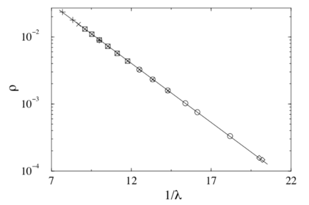
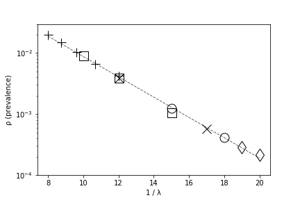
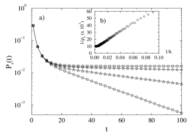
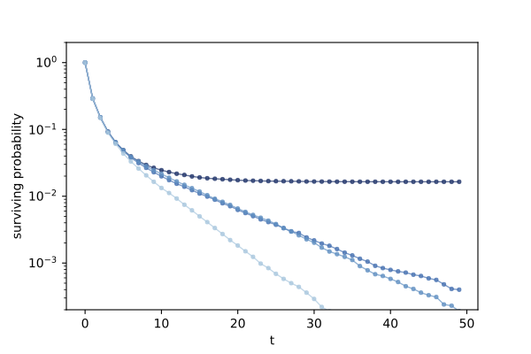

# Simulation of Epidemic Spreading in Scale-free Networks
## by Duncan Hall and Seungin Lyu

### Abstract

How prevalent is epidemic spreading in scale-free networks? What is the survival probability of viruses over a range of time? We answer these questions by replicating an experiment by Pastor-Satorras and Vespignani [1] which involves running the susceptible-infected-susceptible (SIS) model in Barabasi and Albert's (BA) power law graph. We apply their methodology to Facebook dataset (SNAP) to further investigate the validity of their model on a real world scale-free network. We show that viruses with any spreading rate reach a steady state of prevalence on scale-free networks. We conclude that scale-free networks are prone to epidemic spreading regardless of the spreading rate.

### Replication of Pastor-Satorras and Vespignani's experiment

Pastor-Satorras and Vespignani originally asks the question "why do epidemic spreading models with local connectivity contradict with the statistical observations of virus epidemics that viruses are able to pervade and spread much slow than exponentially, and saturate to a low level of persistence?" [1]. After observing and analyzing data reported by virus Bulletin, they claim that previous spreading models which involves graphs with local connectivity like ER graph and WS graph don't illustrate the scale-free nature of the real world networks such as the Internet. While looking for an explanation and designing a model that represents the real world, they hypothesize that running SIS model simulation on Barabasi and Albert's graph will illustrate the exponential tail of virus prevalence.

To find how prevalent epidemic spreading is in various network topologies, we replicate both the experiment that they explicitly conducted with BA graph and the experiments with ER and WS graphs that they did not demonstrate in their paper.

We use the the susceptible-infected-susceptible (SIS) epidemic model as our primary means of simulation.

"Some infections, for example those from the common cold and influenza, do not confer any long lasting immunity. Such infections do not give immunization upon recovery from infection, and individuals become susceptible again."

In SIS model, an infected node recovers with probability (rate) σ, and susceptible nodes are infected if at least one neighbor is infected with probability (rate) µ. We define the spreading rate λ = µ/σ. We are able to fix σ = 1 without loss of generality [1]. Note that updating the status of all nodes is done in parallel; that is, to update the status for time t, only statuses of time (t-1) of the nodes are considered.

We define a list of terms for our experiments. Virus prevalence 'ρ' is the fraction of infected nodes at any time. In this experiment examine the prevalence only when the simulation enters a steady sate with a constant fraction of infected nodes. We evaluate the virus's steady-state prevalence 'ρ' by calculating the mean of infected nodes at time step t over multiple trials (n = 10). Surviving probability Ps(t) is defined as the ratio of trials where the virus is still alive at time step t after their birth to total number of trials conducted.

We use a BA graph generated from the NetworkX's `barabasi_albert_graph(n, k)` function. We set the number of edges to attach from a new node to existing nodes k = 3, providing an average node degree of 6. We use the number of nodes N ranging from 103 to 8.5×106.

We show the results of our simulation in Figure 1.2 and Figure 2.2 in comparison to the original plots [1] in Figure 1.1 and Figure 1.2 respectively. We illustrate that viruses with spreading rate ranging from 1/22 to 1/7 reach a steady state of prevalence `ρ ~ exp(-C/λ)` on the BA graph as shown in both Figure 1.1 and Figure 1.2. We run 100,000 trials to replicate Figure 2.1 up to 50 time steps as shown in Figure 2.2.

|  | 
|-----------|-------------|
| Figure 1. "Persistence ρ as a function of 1/λ for different network sizes: N = 105 (+), N = 5 × 105(◻), N = 106 (×), N = 5 × 106 (○), and N = 8.5 × 106 (◇). The linear behavior on thesemi-logarithmic scale proves the stretched exponential behavior predicted for ρ. The full line is a fit to the form ρ ∼ exp(−C/λ)." [1] | *Figure 2. We quantitatively replicate the original plot shown in Figure 1.1 with each color corresponding to a network size in the original experiment. We confirm that the persistence ρ is indeed semi-logarithmically linear.*  |

 

|  | 
|-------------|-------------|
|*Figure 3. "Surviving probability Ps(t) for a spreading rate λ = 0.065 in scale-free networks of size N = 5 × 105 (◻), N = 2.5 × 104 (◇), N = 1.25 × 104 (△), and N = 6.25 × 103 (○). The exponential behavior, following a sharp initial drop, is compatible with the data analysis of Figure 1.1" [1]* | *Figure 4. We qualitatively replicate the original plot shown in Figure 2.1. Note that we run the simulation for 50 time steps due to time complexity.*|

 

 

### Going Beyond : SIS model simluation on Facebook network

100 Trials, 20 time steps,

We observe that running the same simulation on the Facebook data yields the results shown in Figure 3.

[interpretation]
This result is surprising.
1) Clustering coefficient - BA graph does not have the high clustering of a small world network that is present in the facebook data.
2)

 

 
*Figure 3. We run the SIS model simulation on the Facebook data provided by SNAP. We observe qualitatively semi-logarithmically linear graph as in Figure 1.1 and Figure 1.2 but quantitatively the prevalence is higher in this plot.*

### Conclusion

### Bibliography

#### [1]. [Epidemic spreading in scale-free networks](https://github.com/SeunginLyu/EpidemicSpreading/blob/master/papers/epidemic_spreading_in_SF_networks.pdf)

Pastor-Satorras, R., & Vespignani, A. (2001). Epidemic spreading in scale-free networks. Physical review letters, 86(14), 3200.

Pastor-Satorras and Vespignani  designed a model for the spreading of infections on scale-free networks. They applied the susceptible-infected-susceptible (SIS) epidemiological model on scale-free graphs (Barabasi and Albert). They believe that models with SIS applied to Euclidean lattices, ER graphs, and WS graphs aren’t completely adequate to represent the real phenomenon because the end behavior after time *t* eventually yields either complete extinction or complete prevalence of a computer virus depending on whether the effective spreading rate is greater or less than the epidemic threshold. They discover the absence of the epidemic threshold in scale-free networks and conclude that “infections can proliferate on these scale-free networks whatever spreading rates they may have. These very bad new are, however, balanced by the exponentially small prevalence for a wide range of spreading rate”.

#### [2]. [Epidemic spreading in Real Networks : An Eigenvalue Viewpoint](https://github.com/SeunginLyu/EpidemicSpreading/blob/master/papers/epidemic_threshols_real_networks_eignevalue.pdf)

Wang, Y., Chakrabarti, D., Wang, C., & Faloutsos, C. (2003, October). Epidemic spreading in real networks: An eigenvalue viewpoint. In Reliable Distributed Systems, 2003. Proceedings. 22nd International Symposium on (pp. 25-34). IEEE.

Wang, Yang and Chenxi Wang proposed a ‘general’ epidemic threshold condition that applies to arbitrary graphs and prove that the epidemic threshold is closely related to the largest eigenvalue of its adjacency matrix under reasonable approximations. They point out that the model proposed by Pastor-Satorras and Vespignani is only limited to the BA graph and only works heavily under the assumption that gamma = 3 when *P(k) = k^(-gamma)* (*P(k)* is the probability that a node has *k* links). They validate their epidemic spreading model on both homogeneous graphs like ER graph and power-law scale free graphs like the BA graph. They conclude that their threshold condition holds for arbitrary graphs by validating their model through extensive experiments on real and synthesized graphs.

#### [3]. [Epidemic Thresholds in Real Networks](https://github.com/SeunginLyu/EpidemicSpreading/blob/master/papers/epidemic_thresholds_real_netowkrs.pdf)

Chakrabarti, D., Wang, Y., Wang, C., Leskovec, J., & Faloutsos, C. (2008). Epidemic thresholds in real networks. ACM Transactions on Information and System Security (TISSEC), 10(4), 1.
Chicago

They present a new analytic model called NLDS(nonlinear dynamic system) that makes no assumptions about the network topology and show that their model performs as well or better than the previous models that are targeted specifically to fit certain special case graphs like ER, WS, and BA graphs. This model is an improved version of <i>Epidemic Spreading in Real Networks : An Eigenvalue Viewpoint</i> (written five years later by almost the same group of author). They conclude that their threshold condition can be used to design new network topologies that are more resistant to viruses.
